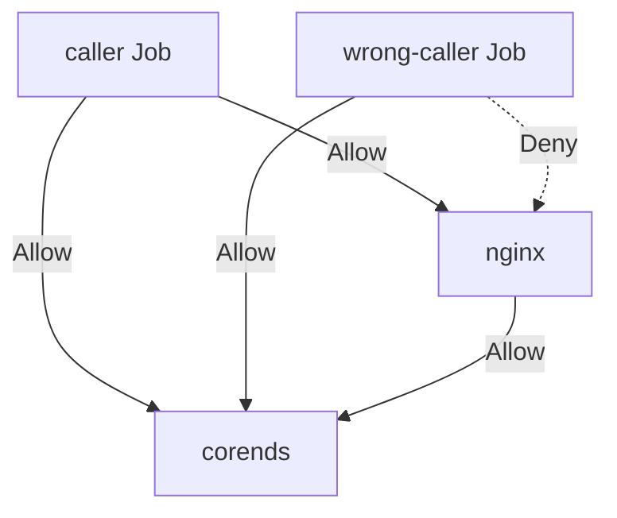

# Network Policies

This example demonstrates how to set up Kubernetes Network Policies in an Amazon EKS cluster using Pulumi.

## Topology

## Components

1. **caller Job**: A Kubernetes Job that is allowed to communicate with both the nginx pod and CoreDNS.
2. **wrong-caller Job**: A Kubernetes Job that is allowed to communicate with CoreDNS but denied access to the nginx pod.
3. **nginx**: A web server pod that can communicate with CoreDNS.
4. **CoreDNS**: The cluster's DNS service, accessible by all pods.

## Network Policies

This example implements the following network policies:

1. Allow the `caller` Job to access both nginx and CoreDNS.
2. Deny the `wrong-caller` Job access to nginx, while allowing access to CoreDNS.
3. Allow nginx to access CoreDNS.
