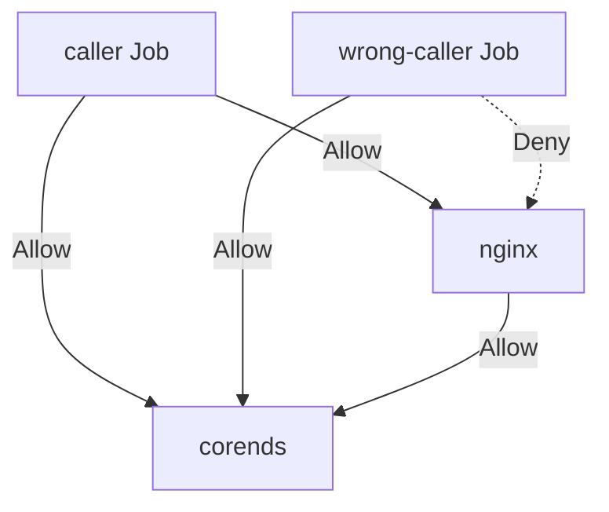

# EKS Pod Security Groups

Demonstrates how to configure your Pulumi EKS Cluster to use Pod Security Groups.

The following shows which pods get deployed by this example and how communication is enforced by the security groups:

